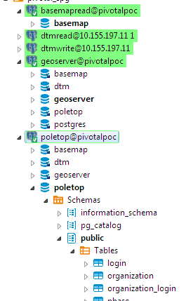
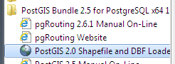
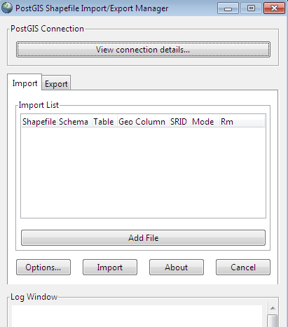

# Correct Spelling and Pronunciation

Let's not dwell on this.

| Spelling | Pronounced | Source |
-----------|------------| ------- |
PostgreSQL | post-GRES-que-ell | https://www.postgresql.org/about/press/faq/ |
PostGIS | post jis | http://mapbrief.com/2015/10/22/postgis-is-so-successful-that-it-needs-to-change-its-name/ |

Let's agree that here in NYC we don't have time for lackadaisical 4-syllable 
behemoths and that we are also good with the abbreviated spelling "Postgres" 
pronounced "post gress". 

As for PostGIS, blame the Canadians...


# psql: Pretty good, if you're in to that sort of thing

"psql is a terminal-based front-end to PostgreSQL."

Anyone with a 'nix like background will likely find psql more intuitive than 
Oracle's SQLPlus.  Also, anyone who's ever attemtped to control the behavior
of SQLPlus via some "SPOOL", "SET DEFINE OFF", etc voodoo at the top of an 
SQLPlus script should find psql refreshing.

A simple psql connection to a database as user "gisuser" on database 
"gisdatabase" hosted locally.  Inputs can be externalized via 
PGXXXXX environmentals.

```
$ export PGPASSWORD=PostgisIsMyDataBae!
$ psql -h localhost -U gisuser -d gisdatabase
psql (10.6)
WARNING: Console code page (437) differs from Windows code page (1252)
         8-bit characters might not work correctly. See psql reference
         page "Notes for Windows users" for details.
Type "help" for help.

gisdatabase=# \q
```

A call to a script in a file using -f


```
$ export PGPASSWORD=PostgisIsMyDataBae!
$ psql -h localhost -U gisuser -d gisdatabase -f gisscript.sql
```

Yields a consistent, nicely formatted output that any shell or scripting 
language can read. Successes print the action.  Errors bounce back as 
as psql:script:linenumber: info 

```
BEGIN
UPDATE 312
COMMIT
GRANT
CREATE VIEW
GRANT
BEGIN
psql:gisscript.sql:83: ERROR:  Geometry type (Polygon) does not match column type (MultiPolygon)
```

Select with -t, -A, -F -c

t: tuples only (no column names, footers)

A: unaligned output 

F: Field separator

c: command

```
$ export PGPASSWORD=PostgisIsMyDataBae!
$ psql -tA -F\| -h localhost -U gisuser -d gisdatabase -c 'select table_schema, table_catalog, table_name from information_schema.tables;'
```

```
public|dtm|geography_columns
public|dtm|geometry_columns
public|dtm|spatial_ref_sys
public|dtm|boundary
public|dtm|raster_columns
public|dtm|raster_overviews
public|dtm|sub_label
public|dtm|reuc_lots
public|dtm|condo_units
-- More  --
```

Cat to a file, amiright?


# Hosts, databases, schemas, roles and infinite possibilities

We create users on hosts. We create databases on hosts.  With appropriate grants 
a user may access multiple databases on the same host.

We create schemas on databases.  But schemas aren't necessarily assigned to users.
By default there's a public schema on each database.

Here's a wild and crazy mix of users, databases, and grants on the Aurora host 
we got access to during the Pivotal proof of concept. Screenshot from Dbeaver.



Moving Oracle stuff over without much private sector thinking seems to transform
Oracle schemas into PostgreSQL databases with one default public schema in 
each database.

How would you, yes you, organize this?


# EZ loading spatial data using PostGIS shapefile loader, ogr2ogr, and shp2pgsql

*PostGIS Shapefile Loader*

Comes with the PostGIS bundle install.  It's a good place to start.





*ogr2ogr*

Works great if you're into this sort of thing, or must convert directly 
to/from formats that aren't shapefiles.

For example, load a geojson file to a new table named *zone_geo_test*.

```
$ ogr2ogr -f "PostgreSQL" PG:"dbname='gisdatabase' host='localhost' port='5432' user='gisuser' password='y'" "C:\Temp\zone_sdo_dmp.geojson" -nln zone_geo_test
```

*shp2pgsql*

The PostGIS Shapefile Loader GUI described above is a wrapper to shp2pgsql. 
From the shp2pgsql command line we have many nice flags and options.

https://postgis.net/docs/using_postgis_dbmanagement.html#shp2pgsql_usage

I am partial to converting shapefiles into SQL and plunking the SQL into version 
control. 

For example, given a shapefile of tax blocks, convert the entire thing to PostGIS
compatible SQL. 

-s: spatial reference identifier

-g: geometry column name 

-m: mapping file for column names that were lopped off in the shapefile

-a: append (inserts only)

```
shp2pgsql -s 2263 -g shape -m /c/matt_projects/dtm2cloud/src/helper/mappingfiles/tax_block_polygon -a /d/matt_projects_data/dtm2cloud/tax_block_polygon.shp tax_block_polygon > /d/matt_projects_data/dtm2cloud/tax_block_polygon.sql
```

Creates an sql file with many inserts, here's one:

```
INSERT INTO "tax_block_polygon" ("boro","block","eop_overlap_flag","jagged_st_flag","created_by","created_date","last_modified_by","last_modified_date","section_number","volume_number",shape) VALUES ('3','2386','0','0',NULL,NULL,'LTP',NULL,'8','5','0106000020D70800000100000001030000000100000016000000004AB030326F2E41008AC87F293E084100864845D96E2E4100CCDB35493B084180C66B1D5A6E2E4100CE91F23B3C084180FF1B3A236E2E4100FEAAB9A43C08410040F122F96D2E4100200F13F53C084100A7A237CA6D2E410006BFA34E3D084180C8487C9C6D2E41002092F0A53D084180BA8875706D2E4100404DFCF93D084180B3EB644E6D2E410056F8023B3E084100CB9D1F2C6D2E4100A8596F7C3E0841008310160B6D2E4100624680BB3E08418035A9EEE76C2E4100AE9E9BFE3E084100B65AADB96C2E4100064CE8563F0841809DB220126D2E41001EA9713742084180FACEB5256D2E4100D8FE81DA420841001B83D43B6D2E41005075B49243084100D50A596B6D2E41007A85631E45084180A8DC03226E2E410076CA8FC0430841007FE9ACD46E2E4100100B686A42084180BD8402346F2E410008D1D4B341084180CD5B6D8B6F2E4100DAE46A0C410841004AB030326F2E41008AC87F293E0841');
```


# PL/pgSQL compared to PL/SQL

TBD.  Looks pretty familiar.  $$ are "dollar quotes" to avoid escaping single quotes
within the text.  We must specify the language because PostgreSQL also supports
pl/perl, pl/python, and some others not part of the core distribution.

```
CREATE OR REPLACE FUNCTION dummy()
RETURNS VARCHAR AS $$
BEGIN
    RETURN 'X';
END;
$$ LANGUAGE plpgsql;
```

```
gisdatabase=# select * from dummy();
 dummy
-------
 X
(1 row)
```

