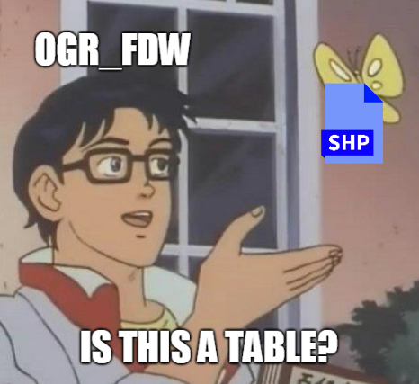
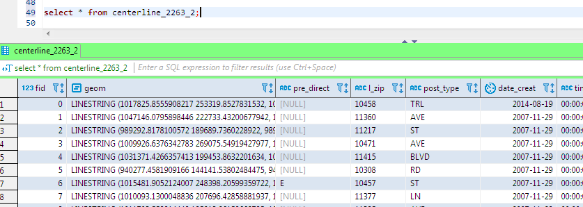

# Correct Spelling and Pronunciation

Let's not dwell on this.

| Spelling | Pronounced | Source |
-----------|------------| ------- |
PostgreSQL | post-GRES-que-ell | https://www.postgresql.org/about/press/faq/ |
PostGIS | post jis | http://mapbrief.com/2015/10/22/postgis-is-so-successful-that-it-needs-to-change-its-name/ |

Also commonly used

| Spelling | Pronounced | Source |
-----------|------------| ------- |
Postgres | post grez | my eyes and ears |


As for PostGIS, blame the Canadians...


<br/>

# psql: Pretty good, if you're in to that sort of thing

"psql is a terminal-based front-end to PostgreSQL."

Anyone with a 'nix-like background will likely find psql more intuitive than 
Oracle's SQLPlus.  Also, anyone who's ever attempted to control the behavior
of SQLPlus via some "SPOOL", "SET DEFINE OFF", etc voodoo at the top of an 
SQLPlus script should find psql refreshing.

A simple psql connection to a database as user "gisuser" on database 
"gisdatabase" hosted locally.  Inputs can be externalized via 
PGXXXXX environmentals.

```
$ export PGPASSWORD=PostgisIsMyDataBae!
$ psql -h localhost -U gisuser -d gisdatabase
psql (10.6)
WARNING: Console code page (437) differs from Windows code page (1252)
         8-bit characters might not work correctly. See psql reference
         page "Notes for Windows users" for details.
Type "help" for help.

gisdatabase=# \q
```

A call to a script in a file using -f


```
$ psql -h localhost -U gisuser -d gisdatabase -f gisscript.sql
```

Yields a consistent, nicely formatted output that any shell or scripting 
language can read. Successes print the action.  Errors bounce back as 
as psql:script:linenumber: info 

```
BEGIN
UPDATE 312
COMMIT
GRANT
CREATE VIEW
GRANT
BEGIN
psql:gisscript.sql:83: ERROR:  Geometry type (Polygon) does not match column type (MultiPolygon)
```

Select with -t, -A, -F -c

t: tuples only (no column names, footers)

A: unaligned output 

F: Field separator

c: command

```
$ psql -tA -F\| -h localhost -U gisuser -d gisdatabase -c 'select table_schema, table_catalog, table_name from information_schema.tables;'
```

```
public|dtm|geography_columns
public|dtm|geometry_columns
public|dtm|spatial_ref_sys
public|dtm|boundary
public|dtm|raster_columns
public|dtm|raster_overviews
public|dtm|sub_label
public|dtm|reuc_lots
public|dtm|condo_units
-- More  --
```

<br/>

# Servers - Roles and Databases. Databases - Schemas. Life - Infinite possibilities

We create databases on a server. A collection of databases managed by a single 
PostgreSQL server instance is a database cluster. A database is the top-level 
container for database objects.

We also create users (or groups of users, aka roles) on a server.  With 
appropriate grants a user may access multiple databases on the same server. But 
a client connection may only access one database for a given connection.

We create schemas on a database as logical structures.  Schemas aren't necessarily 
assigned to users. By default there's a public schema on each database.

Here's a wild and crazy mix of users, databases, and grants on the Aurora host 
we had access to during the Pivotal proof of concept. Notice that all privileges 
for the *basemapread* user have been revoked except for access to the *basemap* 
database.


Moving Oracle stuff over without much private sector thinking seems to pop out
one PostgreSQL database with one default public schema for each Oracle schema.  

How would you, yes you, organize this?  


<br/>

# EZ loading spatial data using PostGIS shapefile loader, shp2pgsql, and ogr2ogr

*PostGIS Shapefile Loader*

Comes with the PostGIS bundle install.  It's a good place to start.


*shp2pgsql*

The PostGIS Shapefile Loader GUI described above is a wrapper to shp2pgsql. 
From the shp2pgsql command line we have many nice flags and options.

https://postgis.net/docs/using_postgis_dbmanagement.html#shp2pgsql_usage

I am partial to converting shapefiles into SQL and plunking the SQL into version 
control. 

For example, given a shapefile of tax blocks, convert the entire thing to PostGIS
compatible SQL. 

-s: spatial reference identifier

-g: geometry column name 

-m: mapping file for column names that were lopped off in the shapefile

-a: append (inserts only)

```
shp2pgsql -s 2263 -g shape -m /c/matt_projects/dtm2cloud/src/helper/mappingfiles/tax_block_polygon -a /d/matt_projects_data/dtm2cloud/tax_block_polygon.shp tax_block_polygon > /d/matt_projects_data/dtm2cloud/tax_block_polygon.sql
```

Creates an sql file with many inserts, here's one:

```
INSERT INTO "tax_block_polygon" ("boro","block","eop_overlap_flag","jagged_st_flag","created_by","created_date","last_modified_by","last_modified_date","section_number","volume_number",shape) VALUES ('3','2386','0','0',NULL,NULL,'LTP',NULL,'8','5','0106000020D70800000100000001030000000100000016000000004AB030326F2E41008AC87F293E084100864845D96E2E4100CCDB35493B084180C66B1D5A6E2E4100CE91F23B3C084180FF1B3A236E2E4100FEAAB9A43C08410040F122F96D2E4100200F13F53C084100A7A237CA6D2E410006BFA34E3D084180C8487C9C6D2E41002092F0A53D084180BA8875706D2E4100404DFCF93D084180B3EB644E6D2E410056F8023B3E084100CB9D1F2C6D2E4100A8596F7C3E0841008310160B6D2E4100624680BB3E08418035A9EEE76C2E4100AE9E9BFE3E084100B65AADB96C2E4100064CE8563F0841809DB220126D2E41001EA9713742084180FACEB5256D2E4100D8FE81DA420841001B83D43B6D2E41005075B49243084100D50A596B6D2E41007A85631E45084180A8DC03226E2E410076CA8FC0430841007FE9ACD46E2E4100100B686A42084180BD8402346F2E410008D1D4B341084180CD5B6D8B6F2E4100DAE46A0C410841004AB030326F2E41008AC87F293E0841');
```

*ogr2ogr*

Works great if you're into this sort of thing, or must convert directly 
to/from formats that aren't shapefiles.

For example, load a geojson file to a new table named *zone_geo_test*.

```
$ ogr2ogr -f "PostgreSQL" PG:"dbname='gisdatabase' host='localhost' port='5432' user='gisuser' password='y'" "C:\Temp\zone_sdo_dmp.geojson" -nln zone_geo_test
```

*OGR Foreign Data Wrapper*



Given a PostgreSQL database with access to an ogr-compatible file or database,
enable the ogr-fdw extension and treat the file or non-PostgreSQL database
like a PostgreSQL table.

https://wiki.postgresql.org/wiki/Foreign_data_wrappers

https://github.com/pramsey/pgsql-ogr-fdw


```
mschell@T2UA64237XN MINGW64 ~
$ ogr_fdw_info -s /c/Temp -l centerline_2263_2
CREATE SERVER myserver
  FOREIGN DATA WRAPPER ogr_fdw
  OPTIONS (
        datasource 'C:/Temp',
        format 'ESRI Shapefile' );

CREATE FOREIGN TABLE centerline_2263_2 (
  fid bigint,
  geom Geometry(LineString,4269),
  pre_direct varchar,
  l_zip varchar,
  post_type varchar,
  date_creat date,
  time_creat varchar,
  pre_type varchar,
  l_blkfc_id real,
  rw_type real,
  frm_lvl_co real,
  shape_leng real,
  l_high_hn varchar,
  status varchar,
  bike_trafd varchar,
  full_stree varchar,
  l_low_hn varchar,
  r_high_hn varchar,
  snow_pri varchar,
  st_name varchar,
  st_label varchar,
  to_lvl_co real,
  post_modif varchar,
  bike_lane varchar,
  trafdir varchar,
  r_zip varchar,
  r_blkfc_id real,
  date_modif date,
  time_modif varchar,
  physicalid real,
  borocode varchar,
  pre_modifi varchar,
  r_low_hn varchar,
  st_width real,
  post_direc varchar
) SERVER myserver
OPTIONS (layer 'centerline_2263_2');
```

This SQL is fetching from the shapefile.  There is no table named cetnerline_2263_2. 




<br/>

# PL/pgSQL compared to PL/SQL

TBD.  Looks pretty familiar.  $$ are "dollar quotes" to avoid escaping single quotes
within the text.  We must specify the language because PostgreSQL also supports
pl/perl, pl/python, and some others not part of the core distribution.

```
CREATE OR REPLACE FUNCTION dummy()
RETURNS VARCHAR AS $$
BEGIN
    RETURN 'X';
END;
$$ LANGUAGE plpgsql;
```

```
gisdatabase=# select * from dummy();
 dummy
-------
 X
(1 row)
```

